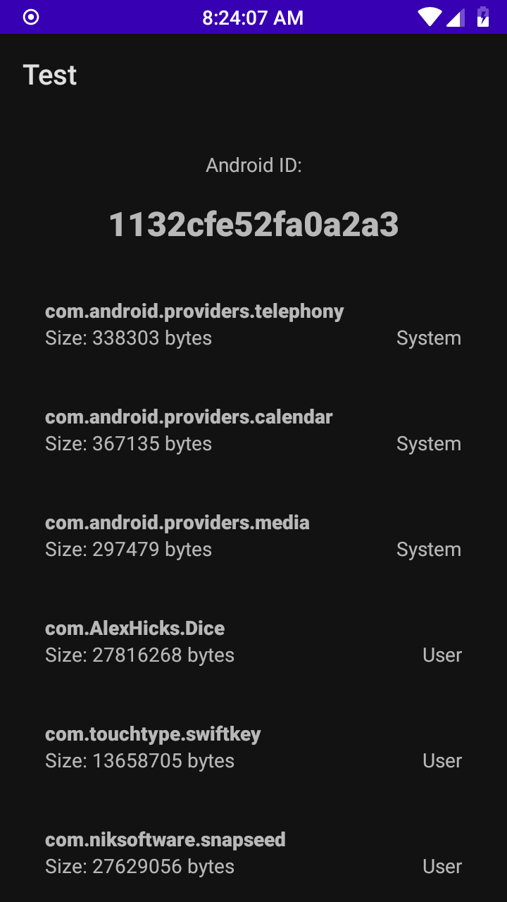

# Android JNI example
The only activity in this application displays all packages installed on device in one scrollable list and `android_id` in a text view.

This project has two modules: `app` and `lib`.

`lib` contains code built as an Android library and includes native functions compiled into a shared library.

`app` contains the single activity of the application, which on its creation calls public methods inside `lib` which in turn call native functions. Those functions then call private Java methods inside `lib`.

Displayed data includes full package name, size of its APK file in bytes and whether the package is installed as a system package.

